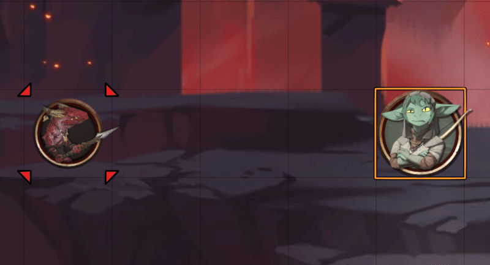
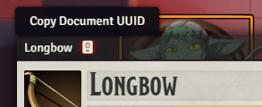
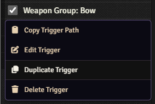
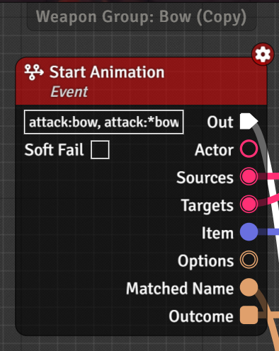
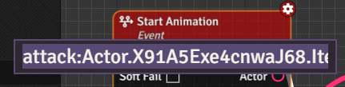
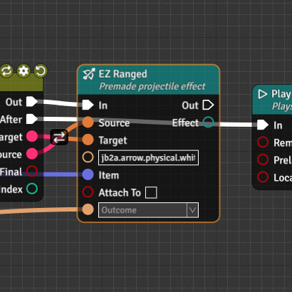

So you want to be shooting fire arrows out of your longbow but don't know how, what do you do? You have to copy the animation and change a few variables. No big task, see the below steps!

## The Steps

import { Steps } from '@astrojs/starlight/components';

<Steps>

1. Open the item you want to change the animation for and copy its UUID by clicking the book icon at the top of the sheet, next to its title. This is the items unique identifier which will let Trigger Animations know you are referencing this specific item.

	

2. Open Trigger Animations menu and find the animation you want to make your own version of. Right click and Duplicate it.

	

3. Find the beginning of the Trigger, which always starts with a **Start Animation** node.

	

4. Change the name of the animation so that the part after `:` is replaced by your UUID, keeping the first part (in this example, `attack:`).

	

5. Modify the trigger to your hearts content and save. For the purposes of this guide, we will just be changing the file from a plain arrow `jb2a.arrow.physical.white.01` to a firey arrow `jb2a.arrow.fire.orange`.

	

</Steps>

## Notes
- Some triggers in [Trigger Animation Trove](https://github.com/ChasarooniZ/pf2e-trigger-animations-collection) can be tricky to override due to its special "handlers," in which case its best to ask the author what to do in an event this guide doesn't work.
- The override works from the fact that the longest name that matches wins. This means that if an item has a sufficiently long item name the UUID can still be on the lower priority, even if extremely unlikely. If you want to avoid this sort of problem, right click and edit the Trigger to increase its Priority above what you are trying to override.