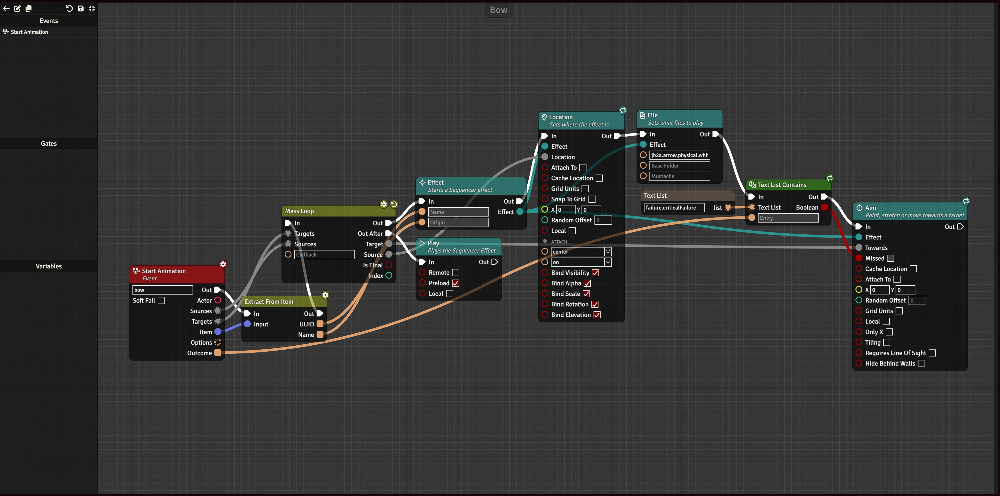
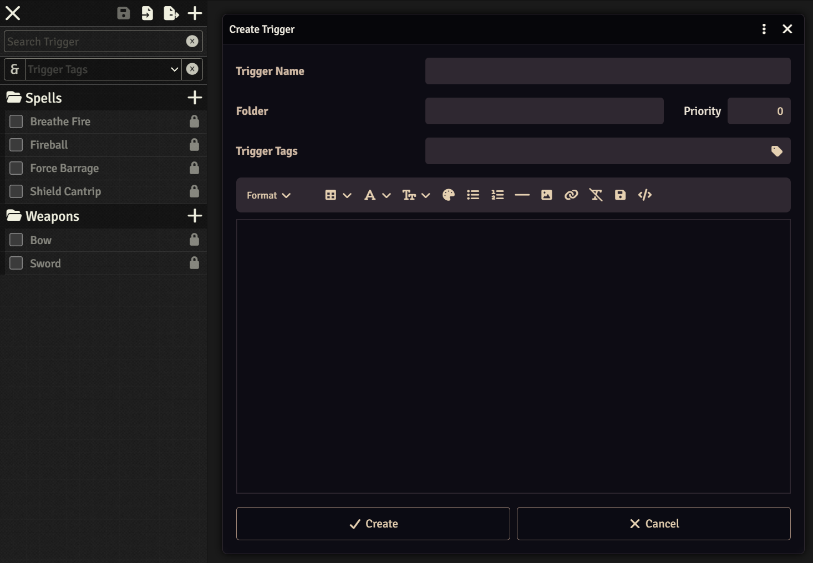
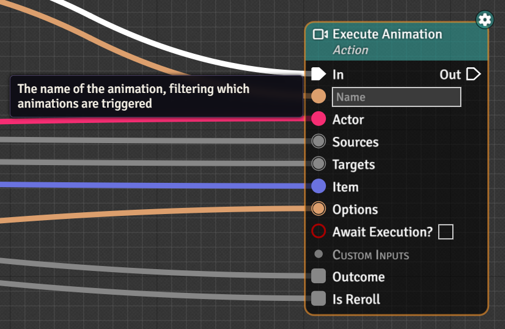
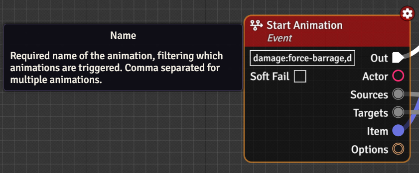
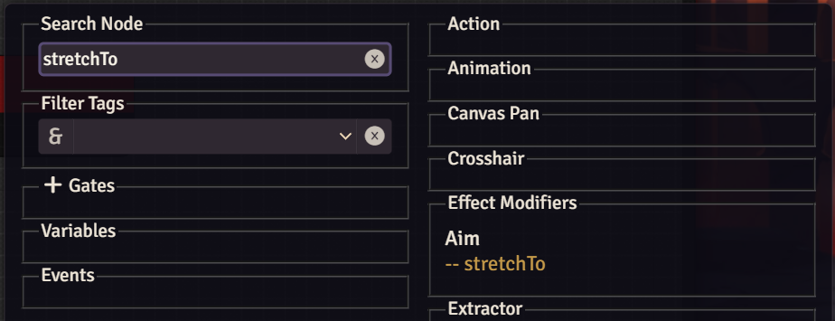

import { Image } from 'astro:assets';
import TriggerEngineImg from "../../../assets/TA.png";
import TriggerEngineImgBlk from "../../../assets/TA_blk.png";

<div class="ta-logo-wrapper">
  <Image
    src={TriggerEngineImgBlk}
    alt="Trigger Animations Logo"
    class="ta-logo ta-logo-light"
  />
  <Image
    src={TriggerEngineImg}
    alt="Trigger Animations Logo"
    class="ta-logo ta-logo-dark"
  />
</div>

Trigger Animations is a free FoundryVTT module that introduces node-based visual programming for your special effect workflows. It is based on top of and in cooperation with [Trigger Engine](https://github.com/reonZ/trigger-engine) to create the UI.

The special effects, also called animations, are built through [Sequencer](https://fantasycomputer.works/FoundryVTT-Sequencer/#/). Effectively, Trigger Animations is a bridge that allows you to make Sequencer's sequences via easily readable nodes.



## Installation

*[See exact steps on FoundryVTT Knowledge Base.](https://foundryvtt.com/article/modules/)*

### Via Manifest URL

Copy the following url and paste it into your Module Installer and press Install.

> https://github.com/MrVauxs/trigger-animations/releases/latest/download/module.json

### Manual

Download the zip from the following url and extract the contents to trigger-animations folder. Put the contents in your FoundryVTT's Data/modules folder.

> https://github.com/MrVauxs/trigger-animations/releases/latest/download/module.zip

## Creating Triggers

:::note
Examples on how to create specific animations will be done in the Guides section of the wiki.
Below is just an overview of how it works.
:::

You can open the modules Trigger Registration menu via the Game Settings button and heading down to Trigger Animations category. There, you are presented with all your created triggers as well as those registered by other modules. These triggers may also be separated into folders.
Triggers have an enabled and disabled state, determining if they're being played or not. If you don't like one animation, it can be disabled.

:::danger
All users have access to this menu, able to enable, disable, create, modify, and delete each others triggers.
:::

Each animation can be given a name, a folder, priority, tags, and a description. Only [priority changes how the trigger functions](#priority-and-name-resolution), everything else is organizational.



Each trigger starts with a Start Animation node, which has a "**Name**" entry. The comma-separated list inside sets what keywords the animation listens to from *Trigger Engine's* Execute Animation node.

<details>
<summary> Execute Animation Node </summary>

The Execute Animation Node is set with a constant name, or is computed based on some characteristic of the event that triggered it, e.g. rolling an attack roll with a longbow will call a `longbow` animation, and receiving damage will call a `damage:longbow` animation. For a full list, see [the included PF2e Triggers list](#included-pf2e-triggers).

| Execute Animation Node | Start Animation Node |
| :------------------: | :--------------------: |
|  |  |

</details>

The entire Trigger constitutes **one** Sequencer sequence built upon layer by layer with each node. Multiple Play nodes will repeat the entire sequence built up to the point of execution. Each node is categorized under its respective section ([Animation](https://fantasycomputer.works/FoundryVTT-Sequencer/#/api/animation), [Effect](https://fantasycomputer.works/FoundryVTT-Sequencer/#/api/effect), [Sound](https://fantasycomputer.works/FoundryVTT-Sequencer/#/api/sound), [Scrolling Text](https://fantasycomputer.works/FoundryVTT-Sequencer/#/api/scrolling-text), [Canvas Pan](https://fantasycomputer.works/FoundryVTT-Sequencer/#/api/canvas-pan), [Crosshair](https://fantasycomputer.works/FoundryVTT-Sequencer/#/api/crosshair), and [generic Sequence functions](https://fantasycomputer.works/FoundryVTT-Sequencer/#/api/home)) and often contains multiple Sequencer functions, related by usage. For example, the "Aim" node contains all the needed inputs for where an effect should go, the offset for that destination position, whether to randomly pick a location, within what range, whether it requires line of sight or be hidden behind walls, etc. etc. Each node relating to a specific section (e.g. Effect) accepts the given section as an input, so multiple sections can be modified irrespective of order of operations (i.e. Effect1 and Effect2 can be created and then appended to even when Effect2 was created last).

:::tip
Each node contains aliases of all of the Sequencer functions that it references, so if you are looking for a specific Sequencer function and don't know which node it belongs to, you can search for that (e.g. searching "stretchTo" will resolve to the Aim node).

:::

### Priority and Name Resolution

When an Execute Animation node is fired, it checks a cache of all active Trigger Animation triggers names and plays **the first match**, using the following algorithm:

- Triggers with a higher priority go before lower priority triggers.
- Ties are broken based on character length of the name.
  - Wildcards (`*`) have a penalty of -0.5 character.

As such, `longbow` will win over `bow` which will win over `bow*`.

### Included PF2e Triggers

The module includes multiple triggers for both Trigger Animations and Trigger Engine to smoothen development. There are also some notably missing triggers that have been left for the reasons described below.

The naming convention of each event describes what animation names the event sends out. As with every trigger, any and all of them can be disabled in favor of your own.

Reasoning behind not including a trigger is most often due to the trigger being too specific for broader purposes or requiring too many combinations of parameters to be wholly encompassing.

| Included | Event               | Naming Convention / Reasoning                          |
| :------: | ------------------- | ------------------------------------------------------ |
|    ✓     | Action Sent to Chat | `item-slug`                                            |
|    ✓     | Attack Rolled       | `item-slug`, `weapon group`, `base-item`               |
|    ✓     | Check Rolled        | `item-slug`                                            |
|    ✓     | Damage Taken        | `(damage\|healing\|persistent\|negated):item-slug`     |
|    !     | Item Added to Actor | `item-slug` (*only applies to Effects and Conditions*) |
|    ✗     | Aura Entered        | *Too Specific*                                         |
|    ✗     | Aura Left           | *Too Specific*                                         |
|    ✗     | Combatant Created   | *Too Specific*                                         |
|    ✗     | Combatant Removed   | *Too Specific*                                         |
|    ✗     | Region Triggered    | *Too Specific*                                         |
|    ✗     | Token Created       | *Too Specific*                                         |
|    ✗     | Token Moved         | *Too Specific*                                         |
|    ✗     | Token Removed       | *Too Specific*                                         |
|    ✗     | Turn End            | *Too Specific*                                         |
|    ✗     | Turn Start          | *Too Specific*                                         |
|    ✗     | On Hook Called      | *Too Specific*                                         |
|    ✗     | Execute Event       | ***Not Applicable***                                   |
|    ✗     | Test Event          | ***Not Applicable***                                   |

## Module Development

To call methods at runtime, read from the module's global:

```ts
const { runFromTrigger } = globalThis.triggerAnimations.api;
runFromTrigger();
```

You can also install `trigger-animations`'s types by installing it as a GitHub dependency:

```sh
npm install github:mrvauxs/trigger-animations
# or better, tied to a specific version
npm install github:mrvauxs/trigger-animations#1.2.3
```

Then import the types either directly in the code or tsconfig.json:

```ts
# Import types directly
import "trigger-animations/types";

# Or add to tsconfig.json
{
  "compilerOptions": {
    "types": ["trigger-animations/types"]
  }
}
```

### Adding Animations via Modules

To add triggers, you can use the [Trigger Engine's registerTriggers](https://github.com/reonZ/trigger-engine/wiki) method, or add the following flag to your module.json.

```json
{
  "flags": {
		  "trigger-animations": {
		  	"triggers": "modules/your-module/yourTriggersFile.json"
	  	},
  }
}
```

## Further reading

- [GitHub repository](https://github.com/MrVauxs/trigger-animations)
- [Sequencer Docs](https://fantasycomputer.works/FoundryVTT-Sequencer/#/)
- [Trigger Engine](https://github.com/reonZ/trigger-engine)